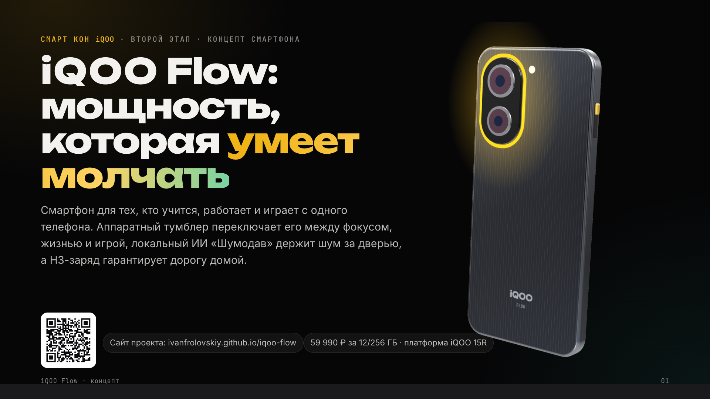

# iQOO Flow — мощность, которая умеет молчать

Концепт смартфона iQOO для молодого поколения. Второй этап технологического чемпионата «Смарт Кон» iQOO 2026.

**Сайт проекта:** https://ivanfrolovskiy.github.io/iqoo-flow/
**Презентация:** [assets/iqoo-flow-presentation.pdf](assets/iqoo-flow-presentation.pdf) · [онлайн-версия](https://ivanfrolovskiy.github.io/iqoo-flow/deck/)



## Идея

Телефон молодого человека одновременно главный инструмент (учёба, работа, оплата, игры) и главный источник
отвлечений: он не знает, чем ты сейчас занят. Молодёжь сама ищет выход — детокс, выключенные уведомления,
брелоки-блокировщики за $39–59, кнопочные телефоны, — и каждый выход что-то отнимает.

iQOO Flow не делает телефон слабее. Он даёт мощности режим:

- **Тумблер** на левой грани: вверх — Игра, середина — Жизнь, вниз — Фокус. Одно движение вместо настроек и силы воли.
- **Шумодав** — локальный ИИ: пропускает важное, остальное собирает в сводку, превращает голосовые в задачи. Без облака.
- **НЗ-заряд**: 8 000 мА·ч, а последние 10% закреплены за оплатой, картами, звонками и мессенджерами.
- **Мощность iQOO**: Snapdragon 8 Gen 5 и игровой чип Q2 на платформе iQOO 15R.

Ключевой сценарий — «Делу — время, потехе — час»: вечер студентки перед дедлайном курсовой, от 146 непрочитанных
до матча без чувства вины. Цена — 59 990 ₽ за 12/256 ГБ.

## Почему так, а не иначе

- **Snapdragon 8 Gen 5, а не 8 Elite Gen 5.** Модель на 3 млрд параметров выдаёт 28 токенов в секунду уже на прошлом
  флагмане Snapdragon 8 Elite, а NPU 8 Gen 5, по данным Qualcomm, на 46% быстрее предшественника. Для сводок этого
  хватает, а цена остаётся на уровне iQOO 15R. Флагманский чип поднял бы телефон к 80 тысячам, как у iQOO 15.
- **8 000 мА·ч, а не 9 020 как в Z11.** Тумблеру нужно место в корпусе, а вес хотелось удержать около 208 г.
  Батарея и так больше, чем у 15R, а гарантированный резерв важнее лишних процентов.
- **12 ГБ памяти, а не 16.** Модели на 3 млрд параметров в 4 битах нужно около 2 ГБ. В 2026 году память — самая
  дорогая часть смартфона, и лишние гигабайты съели бы бюджет.
- **Железный тумблер, а не ещё одна кнопка в настройках.** Режимы фокусировки давно есть в Android и iOS, но до них
  не доходят руки. Физическое движение становится привычкой, и рынок это подтверждает: люди покупают отдельные брелоки
  ради секунды «трения».
- **Сначала софт.** Режимы и Шумодав можно проверить на iQOO 15R и Z11 обновлением по воздуху, а корпус с тумблером
  делать, когда пилот подтвердит гипотезы.

Сложнее всего было с ценой: память дорожает, и честнее показать модельную структуру цены и стресс-тест, чем назвать
красивое число. Все цифры о молодёжи на сайте — из открытых исследований, со ссылками; где выборка не российская
или не молодёжная, это сказано рядом с цифрой.

## Что внутри

```
index.html                  сайт-лонгрид
assets/css/main.css         стили: токены, сцены, телефон, разделы
assets/js/                  core — навигация и скроллителлинг, viz — графики, phone — макет телефона и экраны,
                            scenario — ключевой сценарий, demo — интерактивный тумблер, main — точка входа,
                            phone3d.js — собранная 3D-модель (three.js)
src/phone3d.js              исходник 3D-модели
assets/img/                 постеры модели, OG-картинка
assets/fonts/               Inter, Unbounded, JetBrains Mono (SIL OFL 1.1)
deck/                       презентация 16:9 (HTML), из неё собирается PDF
media/                      слайды презентации в PNG
tools/                      сборка 3D-модуля, рендер постеров и OG-картинки, сборка PDF
```

## Запуск и сборка

Сайт статический, сборка нужна только для 3D-модуля и картинок:

```bash
python3 -m http.server 8791            # из корня репозитория, затем http://localhost:8791
./tools/build3d.sh                     # three.js 0.186.0 + src/phone3d.js → assets/js/phone3d.js (нужны Node.js и npx)
python tools/render_posters.py         # постеры модели (Playwright + Google Chrome, сервер на :8791)
python tools/render_og.py              # картинка для превью ссылки
python tools/build_deck.py             # презентация: PDF и PNG-слайды
```

Без WebGL сайт показывает заранее отрендеренные постеры модели; при `prefers-reduced-motion` анимации отключаются.

## Сторонние материалы

- three.js — MIT, © three.js authors (лицензия в `assets/vendor/three/LICENSE`).
- Шрифты Inter, Unbounded, JetBrains Mono — SIL Open Font License 1.1 (тексты лицензий в `assets/fonts/`).
- Данные исследований и характеристики платформы — из открытых источников, полный список на сайте в разделе «Источники».

Концепт подготовлен для чемпионата «Смарт Кон» iQOO 2026 и не является анонсом или официальным продуктом iQOO.
Названия моделей и товарные знаки принадлежат их владельцам. Изображения устройства — авторская 3D-модель.
